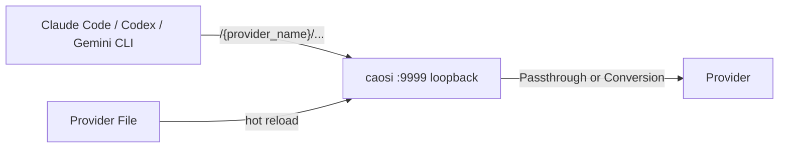
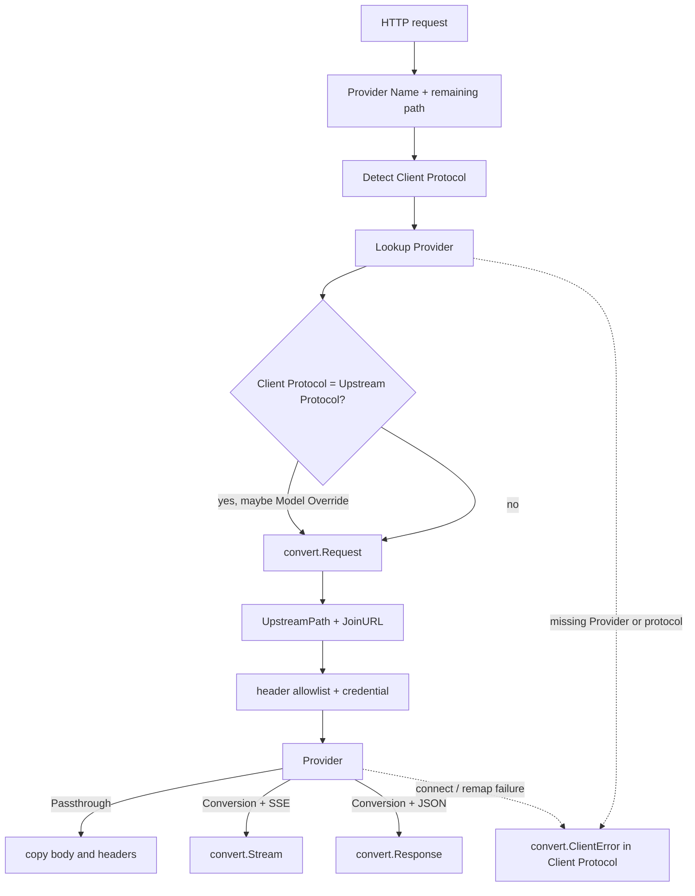
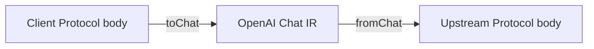
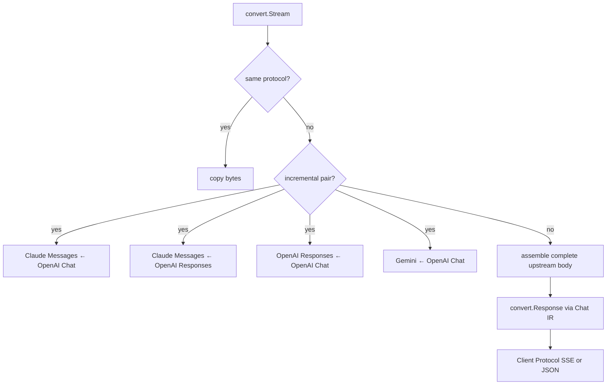
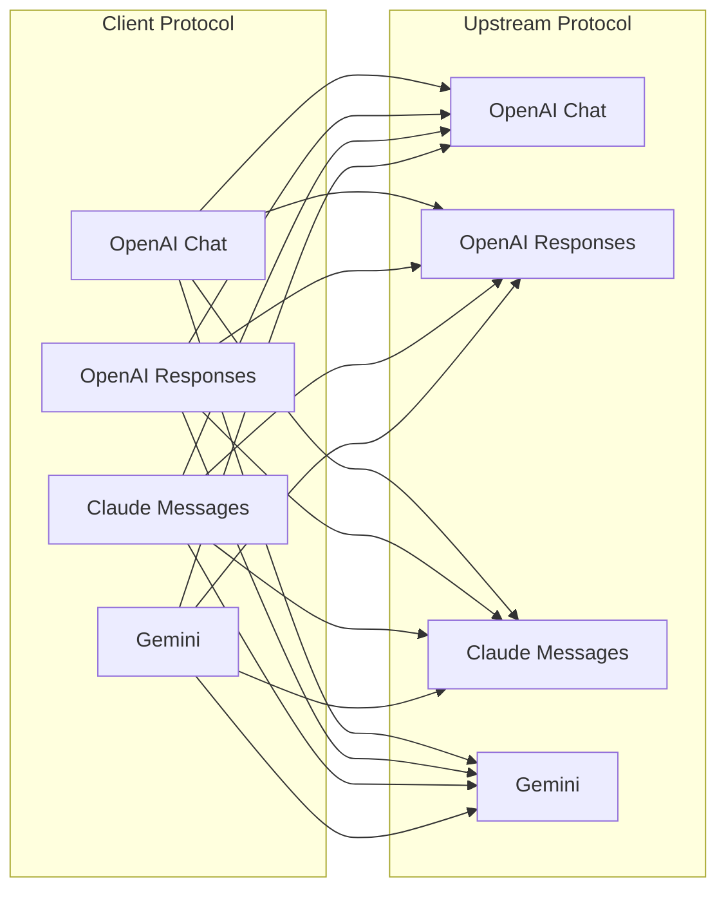
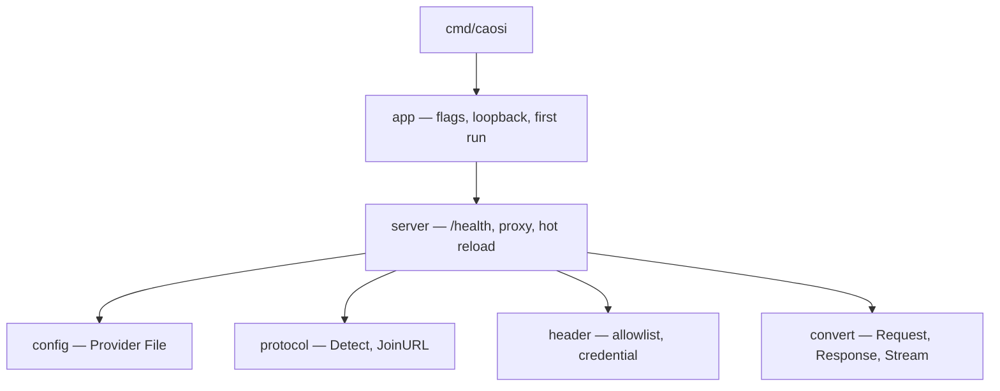

# Architecture

caosi listens on loopback, reads the Provider File, and either Passthroughs or Converts between Client Protocol and Upstream Protocol.

Domain terms: [CONTEXT.md](../CONTEXT.md). Decisions: [adr/](adr/).

## Process

`app` binds loopback, loads the Provider File, and starts `server`. `/health` lists Provider Names. `health` is a Reserved Provider Name.

## Request path

`convert.Request` also applies Model Override when the Provider has one, including on Passthrough.

## Conversion

The Conversion seam is `Request`, `Response`, `Stream`, plus `NeedsConvert`, `UpstreamPath`, `ModelFromBody`, `ClientError`. Pairwise field maps sit behind that seam.

Non-stream Conversion remaps through OpenAI Chat in-process ([ADR-0019](adr/0019-conversion-uses-chat-as-in-process-ir.md)):

The reverse path is `Response`: upstream body → Chat IR → Client Protocol. Upstream errors become Client Protocol errors ([ADR-0008](adr/0008-errors-match-the-client-protocol.md)).

### Stream

Claude Messages ← OpenAI Responses stays incremental ([ADR-0020](adr/0020-claude-responses-stream-is-incremental.md)). Remaining pairs may buffer, then emit a legal Client Protocol stream.

## Protocol grid

Full mesh among OpenAI Chat, OpenAI Responses, Claude Messages, and Gemini ([ADR-0002](adr/0002-full-mesh-streaming-conversion.md), [ADR-0017](adr/0017-full-mesh-includes-cpa-holes.md)):

Same-protocol cells are Passthrough. Cross-protocol cells are Conversion. Conversion Contract: text, system instruction, tools, thinking/reasoning, image parts.

## Packages

| Package | Owns |
| --- | --- |
| `config` | Provider File, Provider, Protocol |
| `protocol` | Client Protocol from path; `base_url` join |
| `header` | Header allowlist by Upstream Protocol; Provider credential |
| `convert` | Passthrough Model Override; Conversion; Client Protocol errors |
| `server` | Listen path, Provider lookup, HTTP hop, hot reload |
| `app` | CLI, loopback bind, first-run template |
